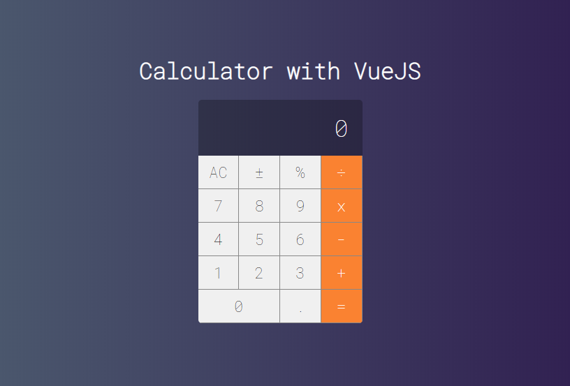

# Calculator

Simple calculator project using VueJS. Product of my personal studies. 
I have also done this project [using React](https://github.com/afmdaniel/Calculator)

## Project setup

In the project directory, you can run:

### `npm install`

to install de project dependecies

### `npm run serve` 

Compiles and hot-reloads for development
Runs the app in the development mode. 
Open [http://localhost:8080](http://localhost:8080) to view it in the browser.

### `npm run build` 

Compiles and minifies for production

### `npm run lint` 
Lints and fixes files

### Customize configuration
See [Configuration Reference](https://cli.vuejs.org/config/).
